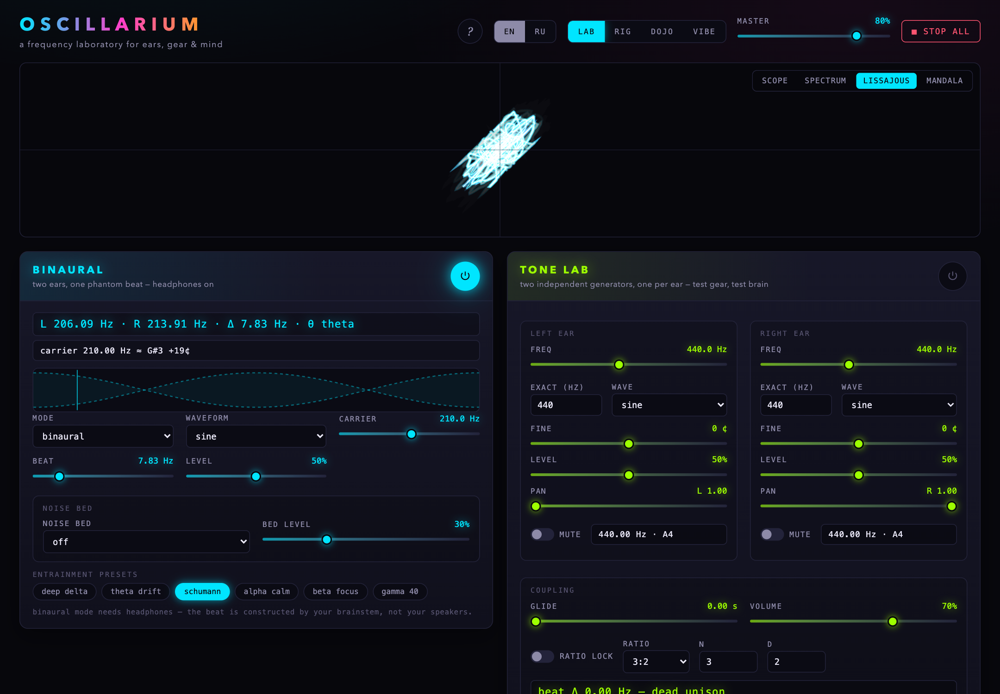
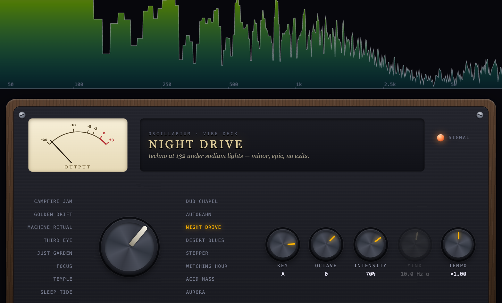
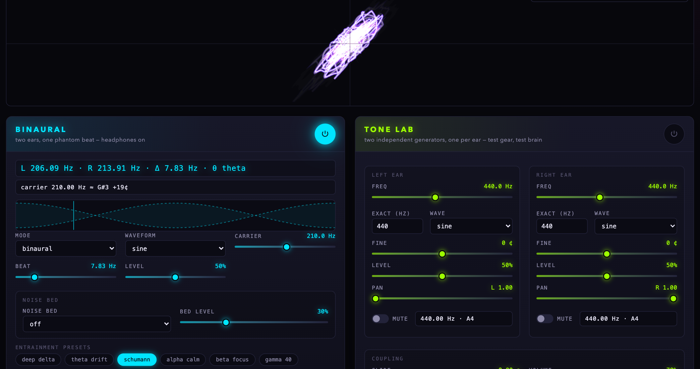
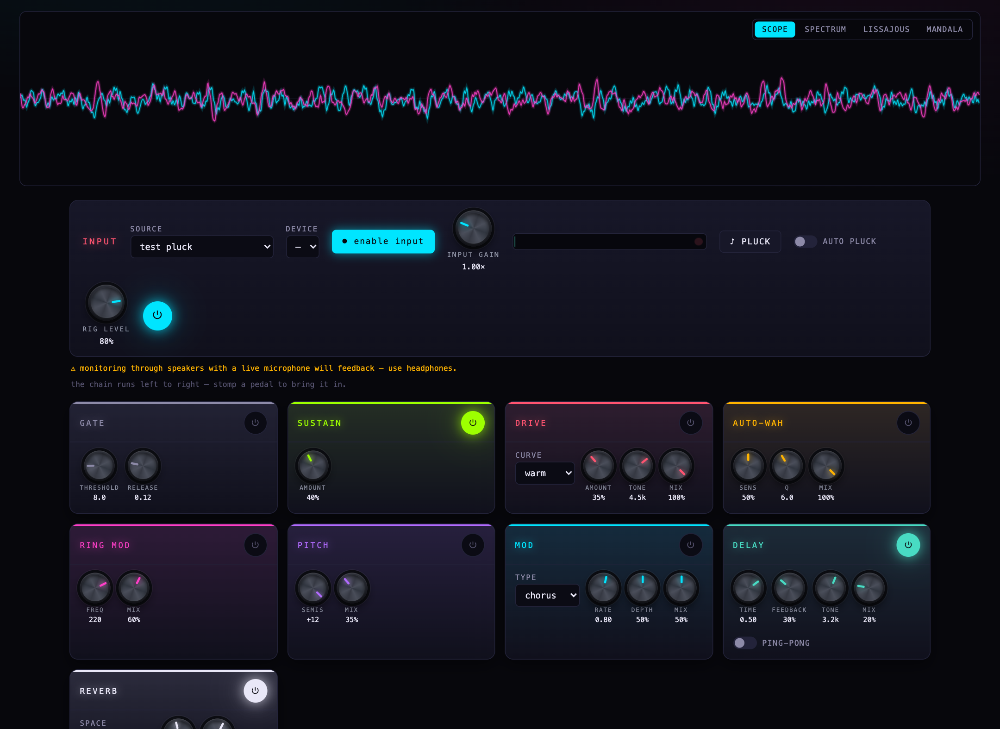
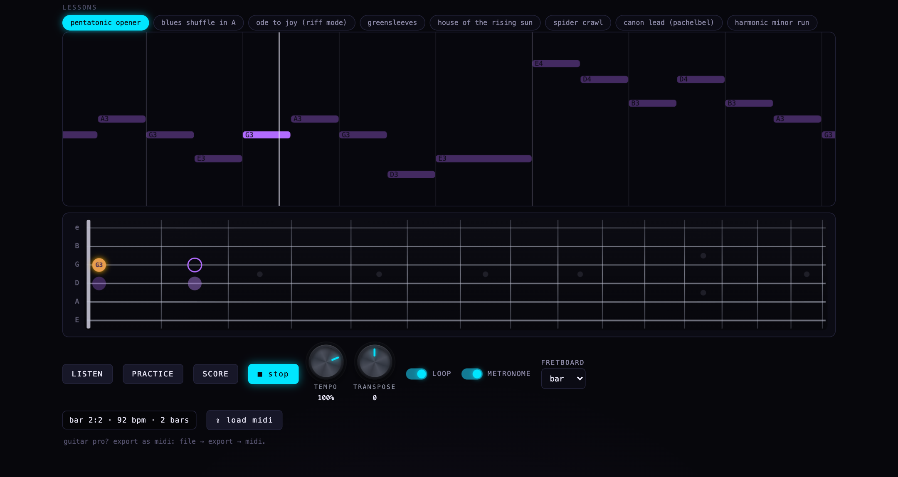
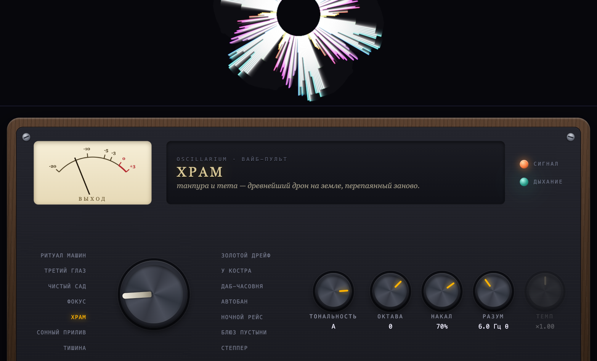

# OSCILLARIUM

**a frequency laboratory for ears, gear & mind** · [Русская версия ниже](#по-русски)



OSCILLARIUM is a self-contained Web Audio playground where audio-gear testing,
music practice, and psychoacoustic experimentation share one patchbay. Pure
vanilla JavaScript — **no build step, no dependencies, no samples, no server,
no tracking. Everything is math.**

## The instruments

Six layerable machines, each with its own power switch, presets, and live
readouts (Hz, note names, cents — always visible, always honest):

| module | what it does |
|---|---|
| **BINAURAL** | binaural / monaural / isochronic entrainment beats, brainwave presets (delta → 40 Hz gamma, Schumann 7.83), pink/brown noise bed |
| **TONE LAB** | two fully independent per-ear generators with ratio locking — 3:2, septimal 7:6, the golden ratio φ, custom n:d — plus beat-frequency readouts. Test headphones, test ears |
| **RHYTHM ⇄ PITCH** | the thesis of the place: a polyrhythm (4:3, 7:6, 4:5:6…) with a rate slider from 0.5 to 400 Hz. Press **SPIN UP** and hear a rhythm fuse into a justly-tuned chord — because they were the same thing all along |
| **DRUMS** | a fully synthesized step-sequencer drum machine: 14 genre presets (house → dub → jungle → 7/8), swing, odd meters, and a GENERATE dice for fresh grooves |
| **DRONE** | supersaw/tanpura drones with sub, just fifth, filter drift — and a chord **PROGRESSION** engine (12-bar blues, I–V–vi–IV, dorian vamps…) that locks to the drum machine's bars. A backing band for your guitar |
| **CHORDS** | diatonic chord pads with an **equal temperament vs just intonation** A/B — hear the beating stop. Play them with keys 1–7 |

Above it all: an oscilloscope, log spectrum, **Lissajous XY** (a binaural beat
appears as an ellipse precessing at exactly the beat frequency), and a
kaleidoscopic mandala.

## The VIBE deck

Flip the **LAB | VIBE** rocker and the cockpit becomes a wooden console with a
chicken-head scene selector, a cream VU meter with real needle physics, a
breath-pacer lamp, and five macro knobs (KEY, OCTAVE, INTENSITY, MIND, TEMPO).



Fourteen scenes mix and match the machines underneath — SLEEP TIDE, TEMPLE,
FOCUS, THIRD EYE, MACHINE RITUAL, CAMPFIRE JAM (half-time drums + four honest
chords, pads following the progression), DUB CHAPEL, AUTOBAHN, NIGHT DRIVE,
DESERT BLUES (twelve bars in E with dom7 stabs), STEPPER… The deck drives the
modules through their remote APIs, so everything a scene sets up is faithfully
mirrored in the cockpit when you flip back.



## The RIG

Flip to **RIG** and plug in — a guitar through an audio interface (iRig-style),
a synth, a microphone, anything `getUserMedia` can see (echo cancellation,
noise suppression and auto-gain are explicitly disabled — this is an
instrument input, not a Zoom call). Nine effects in a fixed chain, every one
synthesized from Web Audio primitives:

**gate → sustain → drive → cab → auto-wah → ring mod → pitch → mod → delay → reverb**



The drive exists for **sustain and clarity** — four curves (warm / tube /
fuzz / octave) with a parallel mix so your note never disappears under the
dirt. The magic lives further right: a granular pitch shifter, a
**shimmer reverb** (pitch-shifted regeneration inside the convolver — the
Eno cathedral sound), and five generated impulse responses including
**haunted** — a reversed IR that makes every note swell backwards out of
nothing.

Seventeen presets in four families: *sustain & clarity* (clean lift, violin
sustain, velvet fuzz, crystal clean), ***modern metal*** (djent, doom wall,
silver lead, frost — a five-curve drive with a `metal` cascade and four
synthesized **cabinet IRs**: 4×12 modern/vintage, 2×12 glass, 1×8 lofi),
*magical / epic* (shimmer cathedral, golden halo, starfield, excalibur), and
*creepy* (séance, poltergeist, mariana trench, graveyard wind, submarine).

Also on the input strip: a real **tuner** (autocorrelation pitch detection,
±5¢ accuracy, cents needle) and a **buffer control** (request 5/10/20/50 ms —
the readout shows what the hardware actually granted). A built-in
Karplus-Strong **test pluck** plays the chain when nothing is plugged in.
Want drop tuning without retuning? Pitch pedal, −2 semitones, mix 100%.

## The DOJO

Interactive lessons — the site *listens to your actual playing* and scores it.



Eight built-in lessons (pentatonic and harmonic-minor licks, a blues shuffle,
a chromatic spider, plus public-domain classics — Ode to Joy, Greensleeves,
House of the Rising Sun, Pachelbel's Canon lead) on a scrolling piano roll.
**LISTEN** plays a lesson, **PRACTICE** loops it with live hit/miss coloring,
**SCORE** counts you in and grades a full pass **S / A / B / C / D** — with a
combo counter, because gamification works.

- A **virtual fretboard** under the roll shows where the notes live — whole
  bar or note-by-note — lighting up as they play, with least-motion position
  solving and realistic fret geometry.
- **PRACTICE** and **SCORE** start with a metronome count-in and big
  on-screen countdown numbers synced to the clicks.
- **TEMPO** slows anything to 40% while you learn.
- **TRANSPOSE** shifts a whole lesson ±12 semitones — play drop-tuned songs
  in standard tuning without touching a peg.
- **LOAD MIDI** imports any `.mid` as a lesson (melody track auto-extracted,
  monophonic reduction). Guitar Pro users: *File → Export → MIDI*.
- Detection is monophonic by design — licks, riffs, solos, melodies. The
  scorer was verified with a synthetic player: correct notes earn an S,
  wrong notes earn a D. It cannot be flattered.

The **?** button in the header opens a bilingual field manual covering all of
this in-app.

Not an amp sim — your modeler keeps its job. This is the weird pedal shelf
it never had.

## Run it

Any static file server works (module scripts won't load from `file://`):

```bash
git clone https://github.com/teloid/OSCILLARIUM.git
cd OSCILLARIUM
python3 -m http.server 4173
# → http://127.0.0.1:4173
```

Headphones recommended. Start at low volume.

## Languages

English and **Russian** — the EN | RU rocker in the header switches instantly
(persisted per browser). Русский встроен как полноценный язык интерфейса.



## Keyboard

| key | action |
|---|---|
| `Esc` | stop everything (panic) |
| `1`–`7` | play chord degrees I–vii° while CHORDS is powered |

## Architecture

```
js/engine.js     one AudioContext · master → limiter → per-ear analysers
                 lookahead Clock · Transport (drum machine drives the bars)
                 music math: note names, cents, septimal-aware ratio naming
js/ui.js         control kit: log sliders, LED power buttons, chips, knobs
js/viz.js        the visualization strip (scope / spectrum / lissajous / mandala)
js/vibe.js       the skeuomorphic scene console
js/i18n.js       optional-language layer (English strings are the keys)
js/modules/*.js  the six instruments — each exports
                 { id, title, tagline, build(), remote: { power, apply, setKey } }
```

Modules build their audio graphs lazily behind one channel each; power-off is
instant (< 100 ms) by contract; every parameter change is click-free (the house
rule: read `param.value` **before** `cancelScheduledValues` — Firefox and
Safari revert cancelled ramps to their origin).

## Safety

Protect your ears: keep levels low, take breaks. Entrainment audio is
experimental play, not medical advice. If you are prone to seizures, treat
pulsing sound and visuals with care.

---

## По-русски

OSCILLARIUM — частотная лаборатория для ушей, железа и разума: бинауральные
ритмы, независимые генераторы на каждое ухо, полиритм, который разгоняется до
аккорда, драм-машина с 14 жанрами, дроны с прогрессиями аккордов (включая
12-тактовый блюз, синхронизированный с барабанами) и аккордовые пэды с
переключением «равномерная темперация / чистый строй».

Режим **VIBE** — деревянный пульт со стрелочным индикатором, селектором сцен и
пятью макро-ручками (тон, октава, накал, разум, темп). Переключатель **EN | RU**
в шапке — и весь интерфейс по-русски.

Режим **RIG** — живая гитара через аудиоинтерфейс: девять синтезированных
педалей (включая кабинеты 4×12 и кривую «метал»), тюнер, буфер задержки,
пресеты от «скрипичного сустейна» до «кладбищенского ветра». Режим **DOJO** —
интерактивные уроки: сайт слышит ваши настоящие ноты и ставит оценку S–D;
темп, транспозиция, импорт MIDI. Кнопка **?** в шапке — полное руководство
на двух языках.

Запуск: любой статический сервер (`python3 -m http.server 4173`) — и в браузер.
Лучше в наушниках, начинайте с малой громкости. Берегите уши; звуковая
стимуляция — экспериментальная игра, а не медицина.

## License

MIT
